# Neural Uncertainty Representation
\

Check out the presentation slides for this work here at [Neural Uncertainty for Differential Emotion Perception](https://docs.google.com/presentation/d/e/2PACX-1vTjkgRzMsWNz7TSoUFUCKKY3sRRfGdyZ3-ir00GGI0mAl2JeuM9UstKTRnTr61I1Q/pub?start=true&loop=true&delayms=3000)

Understanding the Human Brain's working have always fascinated me. The way we learn from things, the way we abstract an idea in our brain, the way we percieve and think of things around us is all related to the highly evolved organ- **The Human Brain**. From the ancient times, endeavours were made by philosophers to understand the functioning of brain and how it abstracts concepts and feelings. In the past of these modern times, scientists tried several methods, techniques, experiments and theory to explain the complex brain functions and even more complex **the representation of emotions in human brain**. That is exactly what we try to deal with here.

# Introduction
Understanding the dynamics of our affective experiences has been one of the hardest problems in the field of neuroscience owing to the complexity of the phenomenon. Prevalent theories have mainly tried to characterize emotions using two dimensions of Arousal and Valence. However, empirical works have shown that these are insufficient in explaining real-life complexity and dynamicity of our affective experiences. In this domain, an unresolved question that still exists is how these emotional experiences change with age. Basing our work on a previous study which showed uncertainty to be a central parameter in mediating affective dynamics, we tried to explain the differential emotional experience in older individuals from a representational and computational level, using unsupervised approaches and sophisticated neural network models.

# Objective
In the past, emotions are understood as a combination of two measures of **Valence** and **Arousal**. Hence, analysis or work on emotions previously meant collecting data on these two variables for each individual. But as per the recent work by Majumdar et. al., it proposes that uncertainty plays an important role in explaining the emotional dynamics. Hence, the objective of our study is to explore this hypothesis as well as trying to come up with a quantification of uncertainty.\
Another major objective of the study is to compare the emotional response between young and old subjects based on the significant difference in uncertainty processing. So, we hypothesize that the lack of uncertainty representation might be the reason of difference in emotions exhibited by young and old subjects. Hence, another goal of our study is to find a sufficient method for uncertainty representation.\
Although both the above goals might be similar, the first one deals with quantitative analysis of uncertainty whereas the second one maybe a visual representation.

# Data
## Stimulus
In our study we analyzed the behavioral data of participants on a Facial recognition task where they were presented with different faces portraying either of the $6$ basic emotions – Happy, Sad, Anger, Fear, Disgust and Surprise.\
For the neural analyses we examined the neuroimaging responses of participants to a tailored version ( $8$ mins) of a black-and-white movie by Alfred Hitchcock called “Bang! You’re Dead!” which we divided into several emotionally dynamic scenes – Ascent (high intense), Descent (low intense) and Control.

## Participants
A total of $209$ participants were selected from the healthy population derived CamCAN cohort. The participants were grouped into Young( $18-35$ years, Mean age: $27.5$) and Old( $60-88$ years, Mean age: $70$).

## Neuroimaging Data
After preprocessing the fMRI (functional Magnetic Resonance Imaging) data, we extracted the BOLD (Blood Oxygen Level Dependent) timeseries for all participants for this movie watching task. The first $4$ scans were removed results in a total of $189$ timepoints (TR) for each participant. We extracted data at both ROI (Region of Interest) and voxel level.\
The final pre-processed data of the $i^{th}$ subject for the $j^{th}$ ROI, let us denote by $X^{(i)}_j$ is of the shape $TRs\times Voxs$, where $TRs$ refer to the total number of time points(each captured at an interval of $2.47$ seconds) which is $189$ and $Voxs$ refer to the total number of voxels in the $j^{th}$ ROI.

# Methodology
For the representational level we wanted to explore the low dimensional manifolds for representation of uncertainty in Young and Old using few data driven analyses. We also carry out computational level of analysis later to capture uncertainty related information.

## Dimension Reduction
Dimension Reduction is a well-known technique for feature extraction and data-visualization of high-dimensional data. In our case, we want to extract low-dimensional signature or pattern of the averaged data $\bar{X_j} = \sum_{i=1,\dots,n} X^{(i)}_j/111$, where $n$ is the number of subjects, for each $j^{th}$ ROI corresponding to the young and the old subjects for the sake of comparison and find out the ROIs which differs the most and might be responsible for uncertainty processing as hinted and analyzed to some extent before. We carried out the following Dimension Reduction techniques:
- Principle Component Analysis(PCA)
- t-Distributed Stochastic Neighbor Embedding (t-SNE)
- Potential of Heat-diffusion for Affinity-based Trajectory Embedding(PHATE)
- Temporal Potential of Heat-diffusion for Affinity-based Trajectory Embedding(TPHATE)

### Principle Component Analysis
The principal components of a collection of points in a real coordinate space are a sequence of $p$ unit vectors, where the $i^{th}$ is the direction of a line that best fits the data while being orthogonal to the first $i-1$ vectors. Here, a best-fitting line is defined as one that minimizes the average squared distance from the points to the line. These directions constitute an orthonormal basis in which different individual dimensions of the data are linearly uncorrelated. PCA is the process of computing the principal components and using them to perform a change of basis on the data, sometimes using only the first few principal components and ignoring the rest.\
The PCA algorithm works by finding the eigenvalues and eigenvectors of the data matrix using Singular Value Decomposition(SVD) and then ordering the eigenvectors in descending order based on the eigenvalues and then picking up first few eigenvectors as the basis and reconstructing the data back by using these new loading vectors. Eigenvalues give the idea about the strength or variance explained.\
In our case we applied PCA on the matrix $\bar{X_j}$ for young and old separately for each $j^{th}$ ROI. PCA is an algorithm which looks at the overall direction of the data to pick up orthogonal directions that explains the variance in the data the most. Apart from just the direction it also sheds light on the magnitude of the strength of the variance explained by each direction. In our case this has the effect of capturing the overall spatial spread of the data in the first two directions which are responsible for explaining majority of the variance and compare the results for young and old. Magnitude of the variance explained gives interesting results for comparing the old and young subject's ROIs.\
PCA captures the overall global relationship in the data at the cost of shattering local information, like proximity of two points or similar characteristics.

### t-Distributed Stochastic Neighbor Embedding
t-SNE is a statistical method for visualizing high-dimensional data by giving each datapoint a location in a two or three-dimensional map. It is a nonlinear dimensionality reduction technique well-suited for embedding high-dimensional data for visualization in a low-dimensional space of two or three dimensions. Specifically, it models each high-dimensional object by a two- or three-dimensional point in such a way that similar objects are modeled by nearby points and dissimilar objects are modeled by distant points with high probability.\
The t-SNE algorithm comprises two main stages. First, t-SNE constructs a probability distribution over pairs of high-dimensional objects in such a way that similar objects are assigned a higher probability while dissimilar points are assigned a lower probability. Second, t-SNE defines a similar probability distribution over the points in the low-dimensional map, and it minimizes the Kullback–Leibler divergence (KL divergence) between the two distributions with respect to the locations of the points in the map.\
In our case we applied PCA on the matrix $\bar{X_j}$ for young and old separately for each $j^{th}$ ROI. t-SNE is primarily a high-dimensional data visualization technique. It sacrifices the global relationship in the data at the cost of preserving local information. We use it to compare how close are the local behavior of the young subject's ROI to the old subject's ROI.

### Potential of Heat-diffusion for Affinity-based Trajectory Embedding
PHATE provides a denoised, two or three-dimensional visualization of the complete branching trajectory structure in high-dimensional data. It uses heat-diffusion processes, which naturally denoise the data, to compute data point affinities. Then, PHATE creates a diffusion-potential geometry by free-energy potentials of these processes. This geometry captures high-dimensional trajectory structures, while enabling a natural embedding of the intrinsic data geometry. This embedding accurately visualizes trajectories and data distances, without requiring strict assumptions typically used by path-finding and tree-fitting algorithms, which have recently been used for pseudotime orderings or tree-renderings of high dimensional data with hierarchy.\
Given a dataset of voxel time-series data, $\bar{X_j}$. Construction of the PHATE diffusion geometry starts by computing the Euclidean distance matrix $D$ between data pairs, where $D(i, j) = ||X_{i,} - X_{j,}||_2$. $D$ is then converted into a local affinity matrix $K$ using an adaptive bandwidth Gaussian kernel. The affinity matrix $K$ is then row-normalized to get the initial probabilities $P_D$, which are used for the Markovian random-walk diffusion process.The diffusion operator $P_D$ is then raised to the $t_D^{th}$ power, where $t_D$ is the PHATE optimal diffusion time scale, to perform a $t_D$-step random walk over the data graph. This specific diffusion process infers more global relations beyond the local affinities. To further preserve both local and manifold-intrinsic global structure of data, PHATE computes the diffusion potential $U$ by taking the logarithm of $P^{tD}_D$ and the diffusion potential distance $D_U$ using distance between row pairs of $U$. This diffusion potential distance can be reduced to $2-3$ dimensions for visualization or to any other dimensionality (such as that obtained by cross-validation) by performing metric MDS (MMDS).

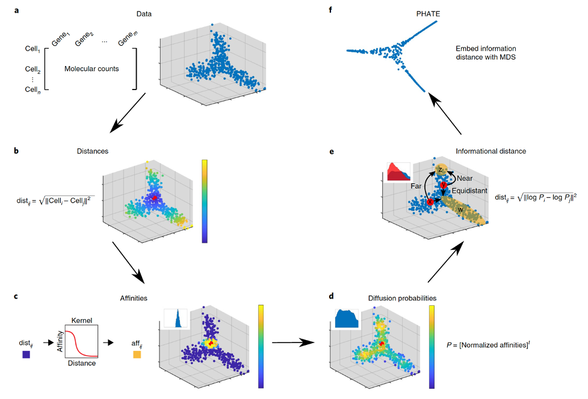 
*Moon et al., Nature Biotechnology 2019, Visualizing structure and transitions in high-dimensional biological data*\
In our case we applied PCA on the matrix $\bar{X_j}$ for young and old separately for each $j^{th}$ ROI. It better captured the closeness between the datapoints wrt vicinity as well as temporal vicinity.

### Temporal Potential of Heat-diffusion for Affinity-based Trajectory Embedding
TPHATE is a modified PHATE algorithm which is able to capture the temporal aspect of the data. The algorithm works the same as original PHATE except for the temporal component infused in the diffusion matrix using the auto-covariance function in a Temporal Affinity Matrix, which is explained below.\
TPHATE as a variant of PHATE that uses a dual-view diffusion operator to embed timeseries data in a low-dimensional space. The first view, $P_D$, of the diffusion operator uses the same process as PHATE to build an affinity matrix based on the Euclidean distance between data samples (here, timepoints) and then row-normalize it to obtain the transition probability matrix, where PD is a TxT matrix. The second view $P_T$ is based on an affinity matrix that summarizes the autocorrelation function of the data. First we calculate a direct estimator of the autocovariance of the timeseries vector $V$ from each voxel using $|V| − 1$ lags. Then the functions are averaged across voxels to obtain a single autocorrelation function ($acf$) and smoothed with a rolling average over $w$ timepoints, to account for possible jittering around where $acf = 0$. Next, we find the first lag $lagmax$ where $acf = 0$, which defines the maximum width of smoothing for the temporal affinity matrix $A$. The temporal affinity matrix A is calculated as $A(i, j) = acf (i, j)$, $0 < |i − j| \leq lagmax$ and $0$ elsewhere. The autocorrelative probability $P_t$ is obtained by row-normalizing the affinity matrix $A$. These views are combined with alternating diffusion into a single operator $P = P_D P_T$, which is used as the initial probabilities for diffusion. The rest of constructing diffusion geometry and data visualization is performed the same as in PHATE. This dual-view diffusion step allows T-PHATE to learn data geometry and latent signals that represent cognitive processes that play out over longer temporal windows.

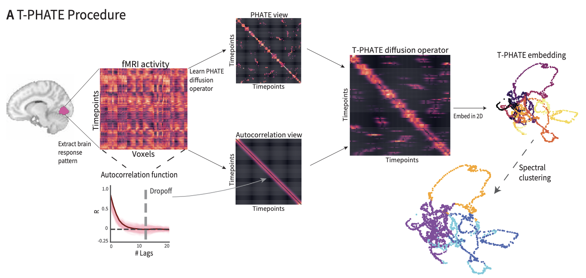 
*Busch et al., TPHATE Algorithm Visualized taken from Temporal PHATE: A multi-view manifold learning method for brain state trajectories*\
It is suited to be applied in the context of High-Dimensional(Number of Voxels) BOLD time series i.e. the matrix $\bar{X_j}$ for young and old separately for each $j^{th}$ ROI.

## Sequence Modelling
Sequence Modeling is the technique of training models on data that has a temporal component associated with it to predict the next value/state. Realizing that our data matrix $\bar{X_j}$ for young and old for each of the $j^{th}$ ROI has a time axis. We looked forward to train sequence models to capture an approximation of the uncertainty information in our model(since, our model will learn to predict the BOLD values given the previous BOLD values). If the predictions are accurate then it will imply we have captured the uncertainty associated with the movie watching data and hence, can be used for quantifying the uncertainty. But there lies several difficulties and challenges to overcome for the model to successfully capture this information. We focused on the following models for our analysis:
- Long Short-Term Memory Neural Network(LSTM)

### Long Short-Term Memory Neural Network
LSTMs are better than Recurrent Neural Networks(RNN) at carrying information from past time steps to farther time steps ahead and improves gradient update values preventing issues like vanishing or exploding gradients which is an issue with RNNs.\
LSTM unit has a memory cell and three gates: input gate, output gate and forget gate. Intuitively, at time step $t$, the input gate $i_t$ controls how much each unit is updated, the output gate $o_t$ controls the exposure of the internal memory state, and the forget gate $f_t$ controls the amount of which each unit of the memory cell is erased. The memory cell $c_t$ keeps the useful history information which will be used for the next process.\
Mathematically, the states of LSTM are updated as follows:

$$i_t = \sigma(W_{xi}x_t + W_{hi}h_{t-1} + W_{ci}c_{t-1} + b_i)$$
$$f_t = \sigma(W_{xf}x_t + W_{hf}h_{t-1} + W_{cf}c_{t-1} + b_f)$$
$$f_o = \sigma(W_{xo}x_t + W_{ho}h_{t-1} + W_{co}c_{t-1} + b_o)$$
$$c_t = f_t\odot c_{t-1} + i_t\odot \tanh(W_{xc}x_t + W_{hc}h_{t-1} + b_c)$$
$$h_t = o_t\odot\tanh(c_t)$$
where $x_t$ is the input vector at the current time step, $\sigma$ denotes the logistic sigmoid function and $\odot$ denotes elementwise multiplication. Note that $W_{ci}, W_{cf}$ and $W_{co}$ are weight matrices.\
For prediction at each time step we pass the hidden state $h_t$ to a fully connected NN with ReLU activation except for the last layer, which can be represented mathematically as follows:

$$\hat{x_{t+1}} = W_{i}\cdot h_{t}$$
$$\hat{x_{t+1}} = relu(\hat{x_{t+1}})$$
$$\dots$$
$$\hat{x_{t+1}} = W_N\hat{x_{t+1}}$$
where $i=1,\dots N$ is the dense layer number.

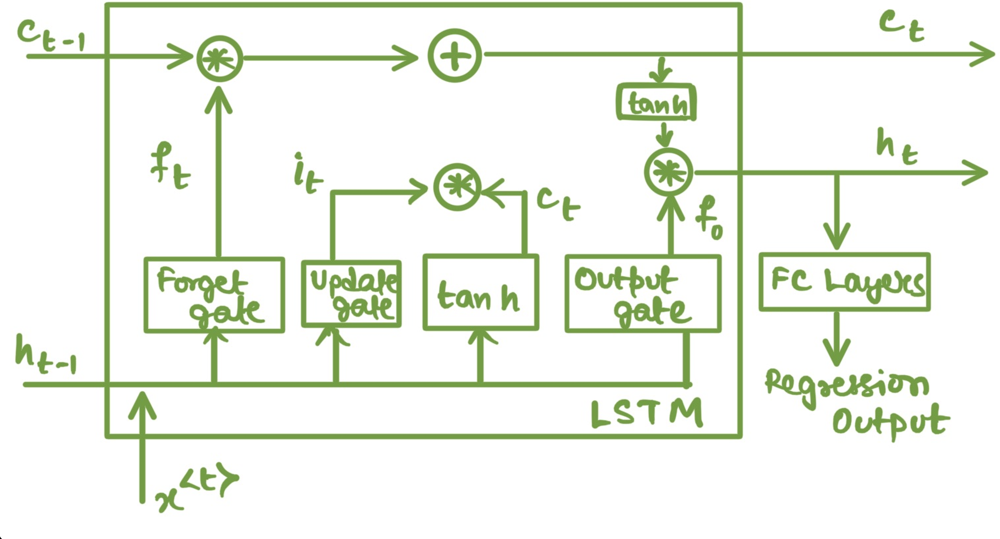 
*Long Short-Term Memory Cell gates and information flow diargam*\
In our case we would be using LSTMs for a regression setup. But the problem arises of how to feed in the inputs to our LSTM model? Since, our data is high-dimensional i.e. the number of voxels per ROI is quite high(atleast $500$, to an upper bound of over $2000$).\
So, we decide on using the following inputs for each subject:
- Average BOLD values(averaged across the voxel BOLDs) for each time point.
- Multivariate BOLD values for each time point(i.e. no reduction number of voxels).

Now, after deciding on the inputs, we have no prior knowledge of what model hyperparameters would suffice or perform the best compared to the others. Hence, we used several different hyperparameter combinations from the following choices:
- $1, 2, 3$ LSTM Layers
- $8, 16, 32, 64, 128$ Hidden Units
- $1, 2, 3, 4$ Dense Layers
- $0.3$ Dropout Probability

Now, the model is trained using Mini-Batch Gradient Descent. We used Adam Optimizer. We trained the models on each ROI separately for $100$ epochs. We used Mini-Batch size of $20$. We used the Mean Squared Error loss function. $111$ young subjects were split into $101$ as training subjects and rest $10$ as validation subjects. As a basic pre-processing step we used MinMaxScaling of the BOLD values, before feeding to the model. Our model is for predicting $1$ TR ahead BOLD values.

Average BOLD LSTM         |  Multivariate(All) BOLD LSTM
:-------------------------:|:-------------------------:
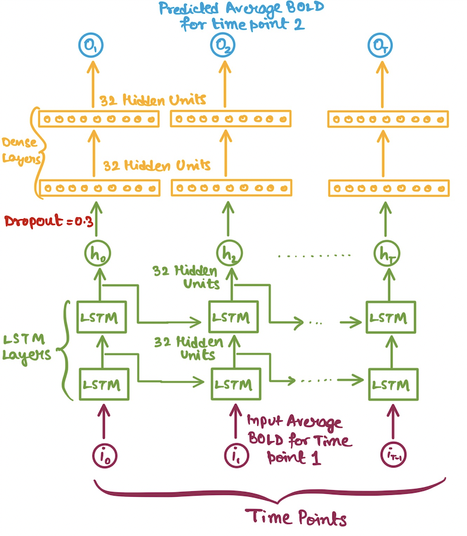  |  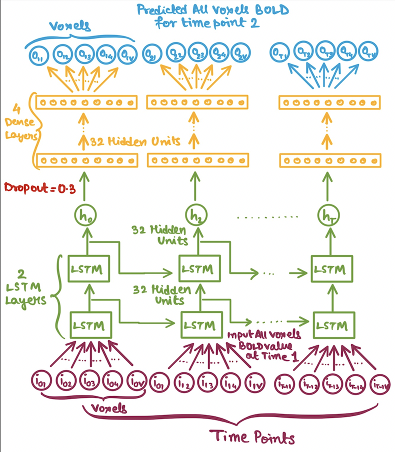

# Results

## Behavioral analysis
To prove that the older people have differential emotion perception than the Young individuals, we looked into their accuracy for the FER task for the Happy, Sad and Fear emotions. We found that for all three emotions the accuracy differed significantly between the two groups (Happy: Mean Accuracy: $98\%$(Y),  $96\%$(O); $p<0.001$; Cohen’s $d = 0.5$; Sad: Mean Accuracy: $96\%$(Y), $83\%$(O); $p<0.0001$; Cohen’s $d=0.99$; Fear: Mean Accuracy: $84\%$(Y), $62\%$(O); $p<0.0001$, Cohen’s $d = 1.13$). However, the negative emotions showed much more difference with a larger effect size.

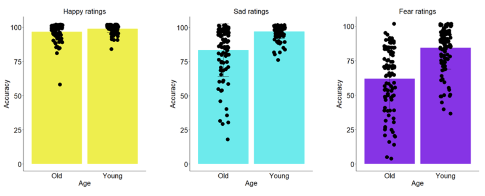 
*The figure shows the difference in Accuracy between the Old and Young groups for the Happy, Sad and Fear emotions in the FER task.*

## Temporal Principle Component Analysis
We employed a spatio-temporal PCA on the BOLD time series extracted from $20$ ROIs (containing sensory, multi-sensory and higher order cortical areas). We found that the first two components could explain $71\%$ of the variance in Young compared to only $57.8\%$  variance in Old hinting on the idiosyncratic nature of their BOLD activation.

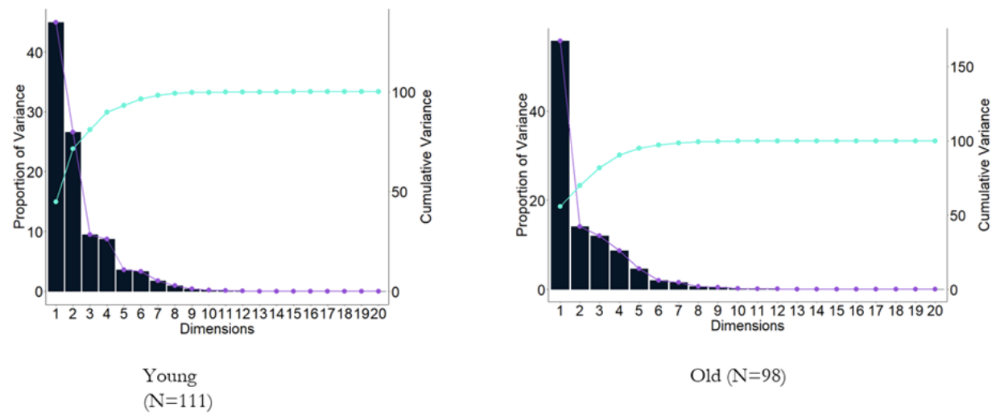 
*Scree plot for the PCA showing the cumulative and proportion of variance explained by each component for the Young and the Old*\
First, to assess the temporal evolution of the first $2$ components, we performed a temporal PCA by computing the dot product of the PC weight vectors with the BOLD time series of the ROIs. This yielded corresponding tPCs (temporal components), which were then averaged across the subjects to obtain the group level tPCs for the Young and Old. We found that the tPC1 correlated highly with Ascent Uncertainty for the Young ($r=0.93$) and Old ($r=0.76$).

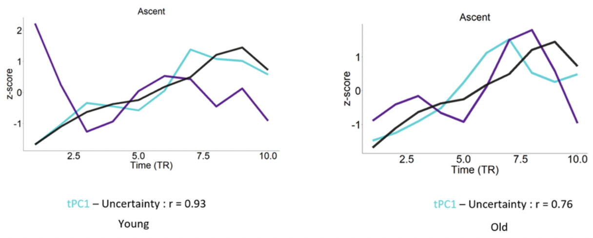 
*Temporal PCA showing the correlation of tPC1 with the Ascent Uncertainty for the two groups*\
Thereafter, we performed a spatial PCA on individual subject’s multivariate data from the Ascent and Descent scenes to obtain the weights associated with each ROI for the first $2$ components. We found that for Young this component was mainly mediated by the lateral regions of the brain while for the Old it was mainly mediated by the medial regions.

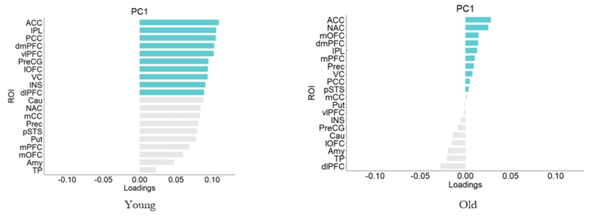 
*Spatial loadings for the PC1 for Young and Old*\

## Temporal Potential of Heat-diffusion for Affinity-based Trajectory Embedding
A recent study showed that for complex representation architecture Temporal PHATE can capture both the global and local information of the data thus adding onto our previous result. We wanted to see whether we can find a significant difference in the low dimensional signature of the lateral and medial orbitofrontal cortex by implementing this TPHATE. The motivation for choosing these areas comes from the previous work from this lab.

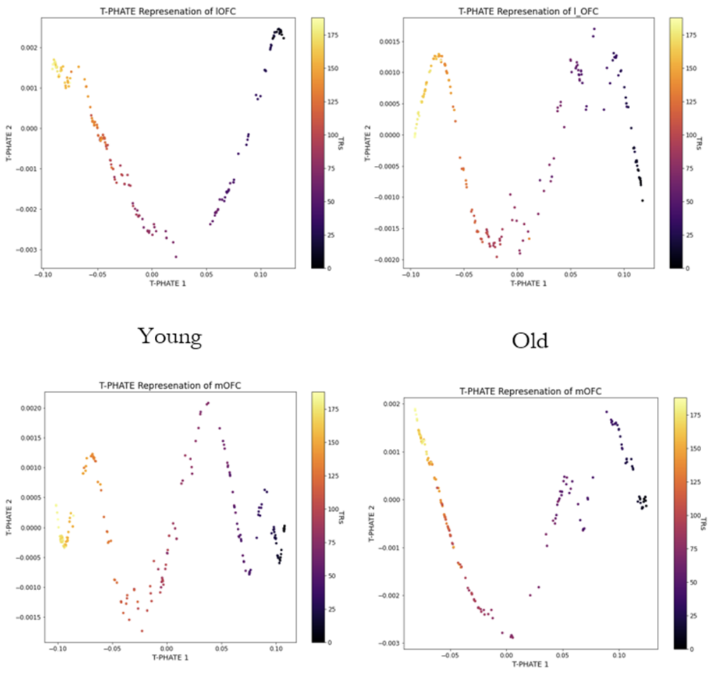 
*TPHATE on the voxel wise BOLD data of the lOFC and mOFC for the Young and the Old*

## Long Short-Term Memory Neural Network
As per the methodology described in the previous section, we after training the models with different sets of hyperparameters and architectures tracked the model performances based on the following criterias: 
- Correlation between the actual and predicted BOLD signals for the validation subjects.
- Scaled training subjects mean squared error loss.
- Scaled validation subjects mean squared error loss.
- Validation subjects mean squared loss.
- Ascent and descent wise actual and predicted BOLD correlation for validation subjects.

We also look at the prediction plots, training loss and validation loss plots to identify any problem with the models.

### Average BOLD LSTM
Here we present the predictions for mOFC and lOFC of the $8^{th}$ young subject for the model with $2$ LSTM Layers, $32$ Hidden Units in both Dense and LSTM Layers, $2$ Dense Layers and $0.3$ Dropout probability are shown below along with the training subjects and validation subjects loss. The correlation between the actual and predicted BOLD signals for $8^{th}$ young subject for mOFC is $0.88$ and for lOFC is $0.87$. The scaled training set MSE loss is $0.00199$ and $0.00166$ for mOFC and lOFC respectively whereas the scaled validation set MSE loss is $0.00157$ and $0.0008$ for mOFC and lOFC respectively. The pink portion indicates ascent, whereas the green portion indicates the descent.

lOFC         |  mOFC
:-------------------------:|:-------------------------:
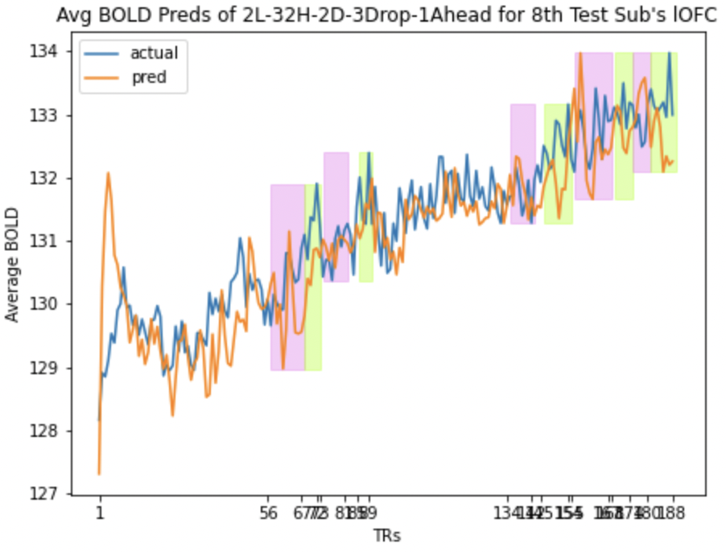*Average BOLD LSTM Predictions*  |  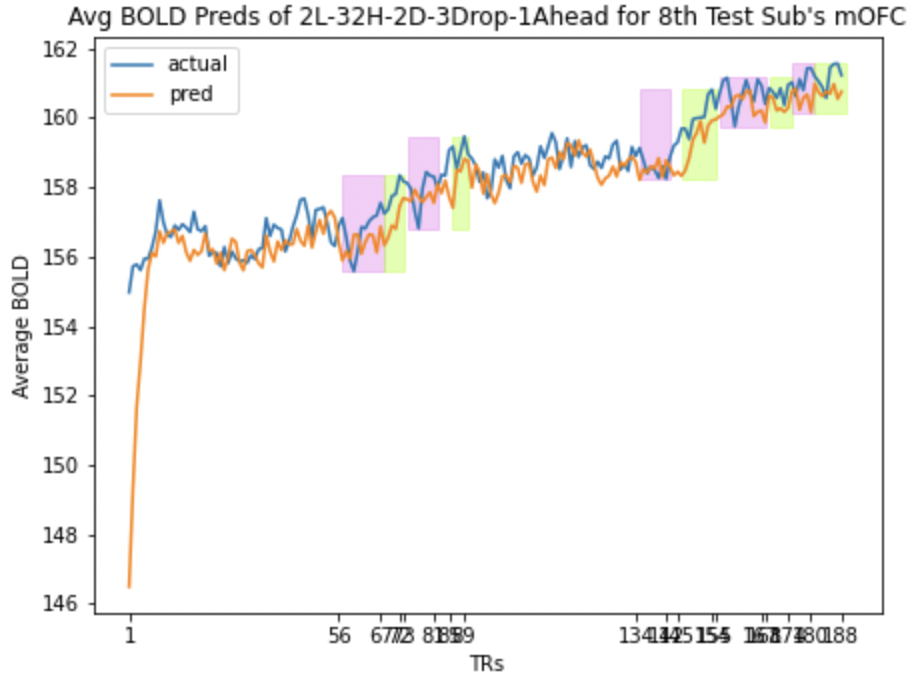*Average BOLD LSTM Predictions*
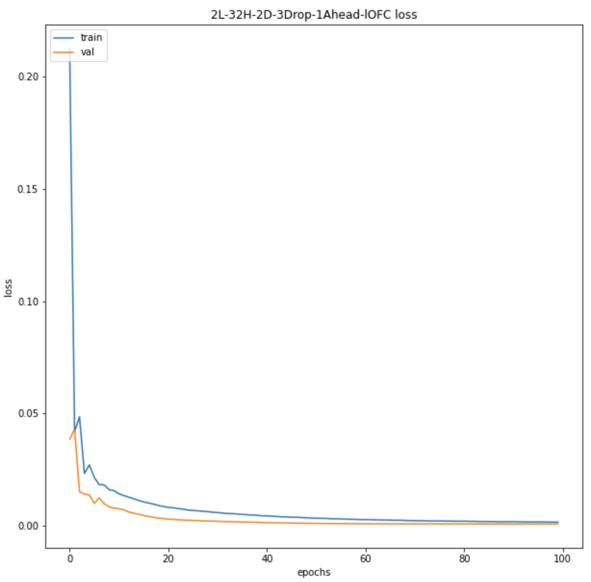*Average BOLD LSTM Loss*  |  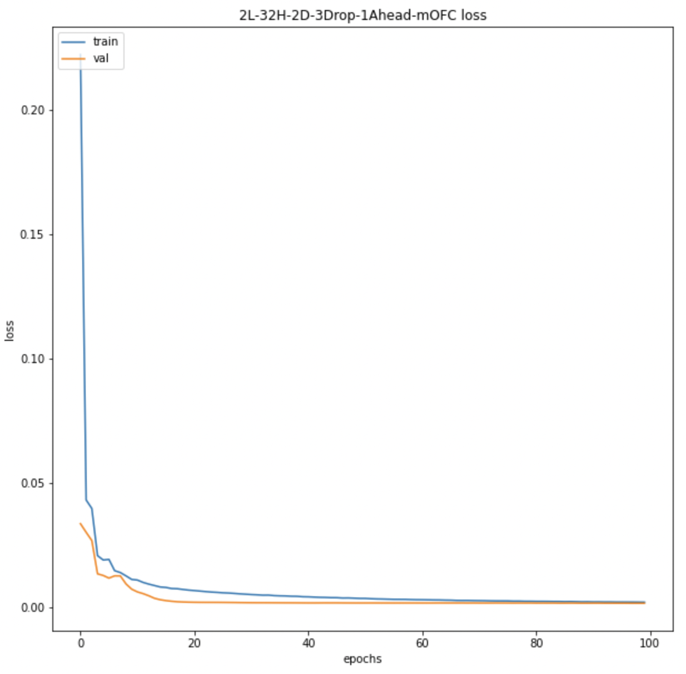*Average BOLD LSTM Loss*

### Multivariate BOLD LSTM
Here we present the predictions for mOFC and lOFC of the $8^{th}$ young subject for the model with $1$ LSTM Layers, $128$ Hidden Units in LSTM Layer, $1$ Dense Layers with 1 Unit and $0.3$ Dropout probability are shown below along with the training subjects and validation subjects loss. The correlation between the actual and predicted BOLD signals for each voxel averaged for $8^{th}$ young subject of mOFC is $0.77$ and of lOFC is $0.79$. The scaled training set MSE loss is $0.00688$ and $0.00687$ for mOFC and lOFC respectively whereas the scaled validation set MSE loss is $0.00297$ and $0.00399$ for mOFC and lOFC respectively. The validation set MSE loss for mOFC and lOFC are $10.61$ and $12.60$ respectively, and the MSE loss for the $8^{th}$ young validation subject is $13.40$ and $10.35$ respectively.

lOFC         |  mOFC
:-------------------------:|:-------------------------:
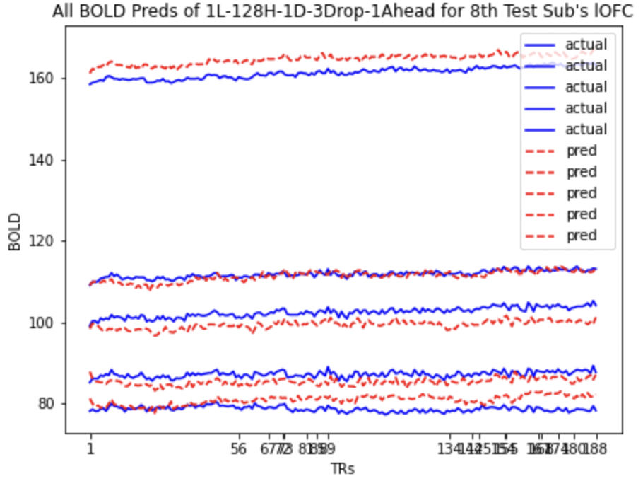*All BOLD LSTM Predictions*  |  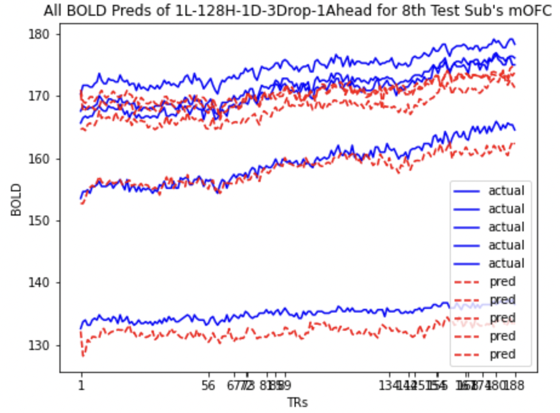*All BOLD LSTM Predictions*
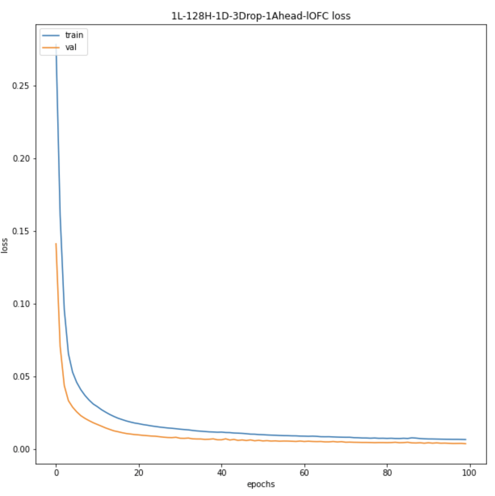*All BOLD LSTM Loss*  |  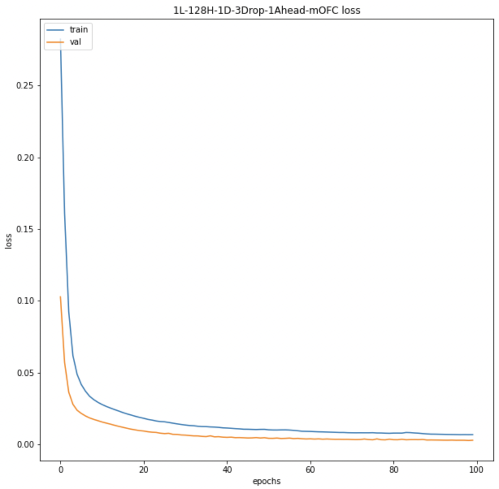*All BOLD LSTM Loss*

# Discussion
By analysing the neuroimaging data using multiple data unsupervised approaches, we observed that the low dimensional representation of the lOFC and mOFC completely shifts from Young to Old. Since lOFC has already been implicated in mediating the Uncertainty in Young this gives us an interesting avenue to look into future. The preliminary LSTM models gave us an few potential branches that we can follow to explore the our main question on estimating how far ahead uncertainty is estimated in Young and Old.

# Future Work
There are a sequence of work lined up following this analysis. Where we will crack down concretely on the computational models and representation extracted from these computational models both quantitative and visual to represent uncertainty.\
Some of the upcoming areas which we plan to extend our work to are:
- Using low-dimensional extracted features like TPHATE along with BOLD values of voxels to see if there is significant improvement in the model being able to capture the uncertainty based information.
- Using Masked Attention Based LSTM Model to extract parts of the BOLD time series to which the model pays most attention for BOLD value predictions of the descents.
- The current models are trained on young subjects data, so we will be using the selected model for the old subjects to compare the results and accuracy.
- Coming to the raised question of how far ahead the young subjects are predicting compared to the old subjects we will train the selected model for $2$ TR, $3$ TR, …, upto $15$ TR ahead prediction and compare the slopes of prediction loss and correlation.
- Using Multi-Modality of our data i.e. incorporating Movie frames information along with BOLD values for each ROIs and coming up with a uncertainty map of regions of focus in the movie as well as the ROIs responsible.
- Devise or track other measures for model selection as well as quantify uncertainty based on metrics for similarity and distance between actual and predicted signals.
- Reduced Voxel Dimensionality using unsupervised methods to extract maximum relevant information.

#### Repo Info
- `Plots`: Contains all the Plots generated from the analysis or codes written in the notebooks. It contains subfolders for `YOUNG` and `OLD`, with further subfolders of `PCA`, etc. corresponding to the class of analysis to which it belongs.
- `Models`: Contains the trained model weights of various architectures and set of hyperparameters. Named accordingly, where `model_weights-1L-128H-1D-3Drop-1Ahead-mOFC` means the weights for the model with $1$ LSTM Layer, $128$ Hidden Units in the Dense Layers(Except Last Layer which has either $1$ unit for Average BOLD LSTM or Number of Voxels units for All BOLD LSTM) and the LSTM Layers, $1$ Dense Layer, $0.3$ Dropout Probability and it is trained for predicting $1$ TR ahead BOLD values.
- `Model-Inference`: Contains the outputs such as predicted BOLD values generated by Models and other numerical outputs which are not plots.
- `Report`: Contains the reports and presentations for intermediate progresses.
- `Jupyter Notebooks(.ipynb)`: Contains the code for the analysis and important values like correlation, MSE loss, etc.
