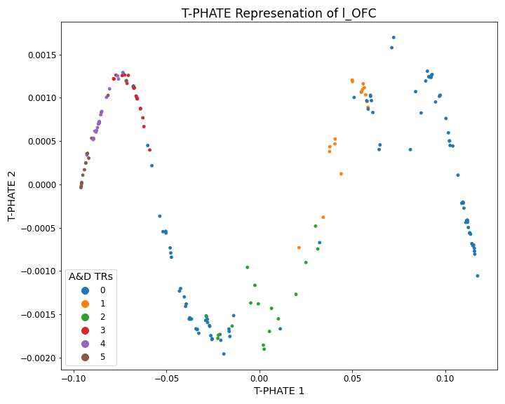
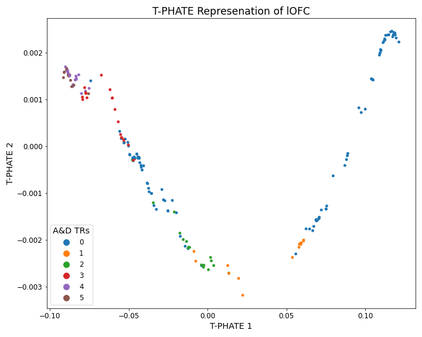
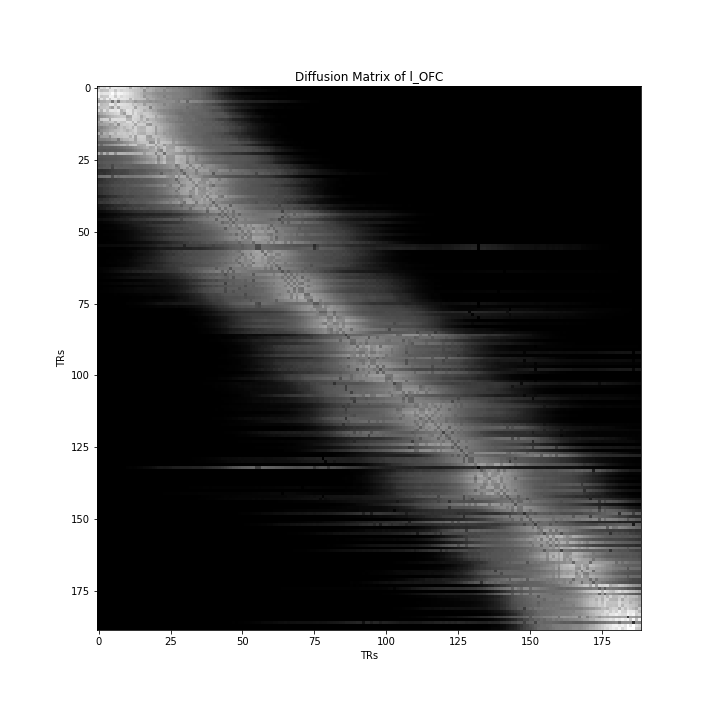
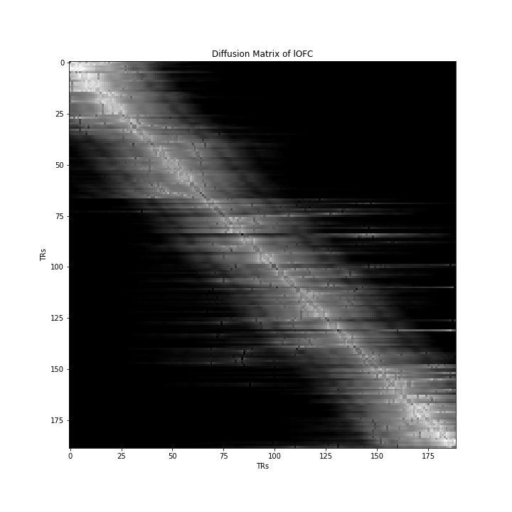

# Neural Uncertainty Representation
Understanding the Human Brain's working have always fascinated me. The way we learn from things, the way we abstract an idea in our brain, the way we percieve and think of things around us is all related to the highly evolved organ- **The Human Brain**. From the ancient times, endeavours were made by philosophers to understand the functioning of brain and how it abstracts concepts and feelings. In the past of these modern times, scientists tried several methods, techniques, experiments and theory to explain the complex brain functions and even more complex **the representation of emotions in human brain**. That is exactly what we try to deal with here.\
Two most common measures developed by Neuroscientists in the past to quantify Human Emotions are:
- Valence
- Arousal

Here, we try to bring in a new candidate in the above two measures, which we strongly believe plays a very important role in explaining Human Emotions.\
**Hypothesis: The measure of `uncertainty` plays an important role in explaining Human Emotions.**\
In this context, we explore several techniques and methods to compare the processing of uncertainty in the young subjects and the old subjects. The literature as well as the data we used for the study(**The CamCan Dataset**) also hints that there is lack of representation of uncertainty in older subjects compared to the younger subjects.

That is exactly what we try to explore i.e. a representation to quantify or visualize uncertainty in our brain. We resort to using several Dimension Reduction Techniques e.g. PCA, t-SNE, PHATE, T-PHATE, etc. We tried to modify few of these dimension reduction technique to fit our needs of coming up with the representation of uncertainty from the BOLD data in the various ROIs of the Brain.
T-PHATE for Old Subjects         |  T-PHATE for Young Subjects
:-------------------------:|:-------------------------:
  |  
  |  

We also explore the completely Data-Driven Approach of using Neural Networks e.g. RNNs, GRUs, LSTMs, etc. to come up with the predictions of the consequent BOLD values and thereby comparing the accuracy drop with the time ahead for which prediction is made to be a quantifier of uncertainty.\
I have implemented ideas from several research papers related to Bayesian Processing Framework for Human Brain, Free Energy Principle, PHATE, T-PHATE, etc.\
**Dataset**: CamCan Data for movie watching of several young and old subjects and analyzing their Brain BOLD Activity.\
**Analysis**: All the Analysis/Codes are available on the `.ipynb` files named intuitively. The plots are available in the `Plots` folder.
